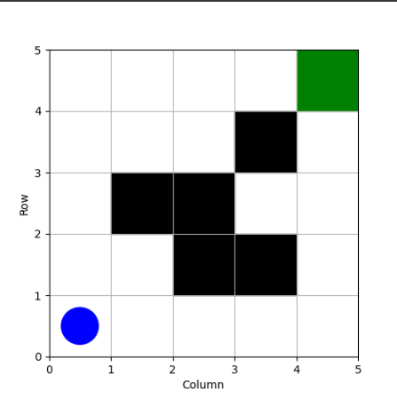
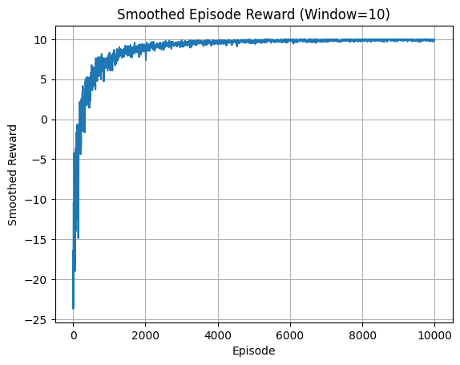

# GrigWorld_DQN_RL

This repository is a basic implementation of Deep Q-Network based Reinforcement Learning to a basic problem of an agent traversing a 2D maze with some obstacles. The purpose of this repository is to present a starting point for anyone interested in learning Reinforcement Learning by presenting an environment built from scratch and RL implemented using Python. This should help visualize the RL framework including the reward structure, MDP, application of Bellman equation, and a basic implementation of Neural Networks using PyTorch to get an overall taste for RL implementation. Anyone can download the code and try different scenarios with different grid sizes, agent's initial position, number of obstacles, and so on.

## Environment

The Environment consists of a 2D maze of size 5x5 with an agent at a specified starting position. The goal of the agent is to reach a final position in a minimal amount of steps following an optimal path and avoiding all the obstacles in the way. The agent is shown with a blue circle, the obstacles/walls with black squares, and the goal is shown as the green square.


<h1 align="center">

</h1>


### State and Action Spaces of the Agent

The state of the agent is fully defined by the x and y positions of the agent on the grid, while the actions the agent is allowed to take are up, down, left, and right. Formally, the state and action spaces are defined as:

$$ S = \begin{bmatrix} x \ y \end{bmatrix}, \quad x, y \in {0, 1, \ldots, grid_{size}-1} $$

$$ A = \begin{bmatrix} 
\uparrow \\
\downarrow \\
\leftarrow \\
\rightarrow
\end{bmatrix}
$$

### Reward Structure
The reward structure is designed to force the agent to move in the direction of the goal. Reaching the goal is given a reward of +10, while negative rewards are given for each step taken (to force fast motion), each time the agent hits an obstacle, or goes out of bounds of the grid. A distance-based reward encourages moving closer to the goal. The reward structure can be formally written as:

$$ R(s, a, s') = \begin{cases} +10 & \text{if } s' = goal_{pos} \\
-0.001 & \text{for any action } a \in A \\
-0.5 & \text{if } s' \in \text{walls} \\
-0.5 & \text{if } s' \text{ is out of bounds} \\
+0.01 \cdot (old_{dist} - new_{dist}) & \text{where } \text{dist} = |s_x - goal_x| + |s_y - goal_y|
\end{cases} $$

## Reinforcement Learning Framework

The problem is formulated as a Markov Decision Process (MDP), defined by the tuple ((S, A, P, R, $\gamma$)):

* States (S): Agent’s position (x, y).
* Actions (A): Four movement actions (up, down, left, right).
* Transition Probability (P): Deterministic transitions based on actions, constrained by walls and grid boundaries.
* Reward Function (R): As defined above.
* Discount Factor ($\gamma$): Set to 0.99 to prioritize long-term rewards.

The MDP satisfies the Markov property: the next state (s') and reward (r) depend only on the current state (s) and action (a), not the history of states or actions. This allows the agent to plan optimal actions based solely on its current position, making it suitable for RL.

### Bellman Equation and Q-Value Updates

The goal is to learn an optimal policy $\pi(s)$ that maximizes the expected cumulative discounted reward. The DQN approximates the optimal Q-function $Q(s, a)$, which represents the expected future reward for taking action (a) in state (s) and following the optimal policy thereafter. The Bellman equation for the optimal Q-value is:

$$ Q(s, a) = \mathbb{E} \left[ r + \gamma \max_{a'} Q(s', a') \right] $$

where:
$r$ is the immediate reward.

$\gamma$ = 0.99 is the discount factor.

$s'$ is the next state.

$a'$ is the next action.

The DQN updates Q-values using a neural network to minimize the temporal difference (TD) error. For a transition (s, a, r, s', done), the target Q-value is:

$$ target-Q = r + \gamma \cdot \max{a'} Q(s', a'; \theta^-) \cdot (1 - \text{done}) $$

Here $\theta$ is the Nueral Network Weight parameter which basically represents our policy

The loss is the mean squared error:

$$ \text{Loss} = \mathbb{E} \left[ \left( Q(s, a; \theta) - \text{target}_Q \right)^2 \right] $$

This is implemented in the training loop:

``` python
q_values = agent.model(states)
current_q = q_values.gather(1, actions.unsqueeze(1)).squeeze(1)
with torch.no_grad():
    next_actions = agent.model(next_states).max(1)[1]
    next_q_values = target_model(next_states).gather(1, next_actions.unsqueeze(1)).squeeze(1)
    target_q = rewards + gamma * next_q_values * (1 - dones)
loss = F.mse_loss(current_q, target_q)
``` 
## Deep Q-Network (DQN) Framework

The DQN is a neural network approximating $Q(s, a)$:

* Input: Normalized state $x-grid_{size}, y-grid_{size}$, dimension 2.

* Hidden Layers: Two fully connected layers with 64 units each, ReLU activation.

* Output: Q-values for each action, dimension 4.

* PyTorch Implementation: Uses PyTorch for GPU-accelerated training (e.g., T4 GPU in Colab) with the Adam optimizer (learning rate 0.0005).

Code:

``` python
class DQN(nn.Module):
    def __init__(self, input_dim=2, output_dim=4):
        super(DQN, self).__init__()
        self.fc1 = nn.Linear(input_dim, 64)
        self.fc2 = nn.Linear(64, 64)
        self.out = nn.Linear(64, output_dim)
    def forward(self, x):
        x = F.relu(self.fc1(x))
        x = F.relu(self.fc2(x))
        return self.out(x)
```
## Key Techniques

### Experience Replay

A replay buffer (capacity 20,000) stores transitions (s, a, r, s', done). Random minibatches (size 64) are sampled to break temporal correlation and improve sample efficiency, ensuring the agent learns from rare goal-reaching experiences (e.g., max reward 9.968).

Code:

``` python
class ReplayBuffer:
    def __init__(self, capacity):
        self.buffer = deque(maxlen=capacity)
    def push(self, state, action, reward, next_state, done):
        self.buffer.append((state, action, reward, next_state, done))
    def sample(self, batch_size):
        return random.sample(self.buffer, batch_size)
```
### Target Network

A separate DQN with parameters $\theta^-$ computes stable target Q-values, updated every 1000 steps to match the main DQN $\theta$. This reduces the moving target problem, stabilizing training.

Code:

``` python
target_model.load_state_dict(model.state_dict())
```
### Double DQN

Uses the main DQN to select the next action and the target DQN to evaluate it, reducing Q-value overestimation:

$$ \text{target}Q = r + \gamma \cdot Q(s', \arg\max{a'} Q(s', a'; \theta); \theta^-) $$

Code:

``` python
next_actions = agent.model(next_states).max(1)[1]
next_q_values = target_model(next_states).gather(1, next_actions.unsqueeze(1)).squeeze(1)
```
### Epsilon-Greedy Exploration

Linear decay from $\epsilon$ = 1.0 to 0.05 over 30% of episodes balances exploration and exploitation, enabling the agent to exploit the learned policy (rewards ~9.9).

Code:

``` python
epsilon_decay = max_episodes * 0.3
agent.epsilon = max(epsilon_end, epsilon_start - (epsilon_start - epsilon_end) * episode / epsilon_decay)
```

### Reward Shaping

A distance-based reward guides the agent toward the goal, addressing sparse rewards in the 5x5 grid.

Code:

``` python
old_dist = abs(self.agent_pos[0] - self.goal_pos[0]) + abs(self.agent_pos[1] - self.goal_pos[1])
new_dist = abs(self.agent_pos[0] - self.goal_pos[0]) + abs(self.agent_pos[1] - self.goal_pos[1])
reward += (old_dist - new_dist) * 0.01
```
### Gradient Clipping

Clips gradients to a max norm of 1.0 to prevent large updates from destabilizing training.

Code:
``` python
torch.nn.utils.clip_grad_norm_(model.parameters(), max_norm=1.0)
```
## Results

5x5 Grid:
Converged to average rewards ~9.9 after 1000–3000 episodes, indicating the agent reaches (4, 4) in ~8–10 steps. The animation shows the optimal path:

The reward convergence is shown in the following figure:

<h1 align="center">

</h1>
